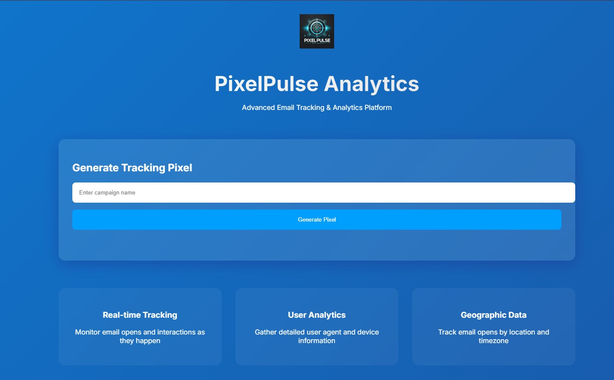

# PixelPulse Analytics 📊

PixelPulse Analytics is a powerful email tracking system that uses pixel tracking technology to monitor email opens, gather user information, and provide insights into email campaign performance.



## Features ✨

- **Email Open Tracking**: Monitor when recipients open your emails
- **Campaign-Specific Tracking**: Create unique tracking pixels for different email campaigns
- **User Analytics**: Collect user agent and device information
- **IP Tracking**: Track geographical location of email opens
- **Real-time Logging**: Instant logging of all email interactions
- **Modern UI**: Clean, responsive interface with animated background

## Tech Stack 🛠️

- **Backend**: Python Flask
- **Frontend**: HTML, CSS, JavaScript
- **Database**: File-based logging system

## How to Use 🚀

1. Visit the website
2. Enter your campaign name (e.g., "newsletter-january", "welcome-email")
3. Click "Generate Pixel"
4. Copy the generated HTML code
5. Paste it into your email template
6. Send your email and track opens!

Example tracking pixel code:
```html

```

## Local Development 💻

### Backend Setup

```bash
# Clone the repository
git clone https://github.com/Malik-0032/PixelPulse-Analytics.git

# Navigate to project directory
cd PixelPulse-Analytics

# Install dependencies
pip install -r requirements.txt

# Run the development server
python app.py
```

### Frontend Setup

Simply open `index.html` in your browser or use a local server:
```bash
# Using Python's built-in server
python -m http.server 8000
```

## API Endpoints 🔌

- `GET /`: Health check endpoint
- `GET /pixel/<campaign_id>.png`: Serves tracking pixel and logs access
- `GET /logs`: View logged data

## Logging Format 📝

Each log entry contains:
```
[TIMESTAMP] Campaign: CAMPAIGN_ID | IP: IP_ADDRESS | UA: USER_AGENT
```

## Deployment 🚀

### Backend (Render)

1. Create a new Web Service on Render
2. Connect your GitHub repository
3. Set build command: `pip install -r requirements.txt`
4. Set start command: `gunicorn app:app`

### Frontend (GitHub Pages)

1. Push frontend files to GitHub
2. Enable GitHub Pages in repository settings
3. Update `API_BASE_URL` in `script.js` with your Render backend URL

## Contributing 🤝

1. Fork the repository
2. Create your feature branch (`git checkout -b feature/AmazingFeature`)
3. Commit your changes (`git commit -m 'Add some AmazingFeature'`)
4. Push to the branch (`git push origin feature/AmazingFeature`)
5. Open a Pull Request

## Security Considerations 🔒

- This is a basic implementation for educational purposes
- In production, consider:
  - Adding authentication
  - Encrypting sensitive data
  - Implementing rate limiting
  - Using a proper database
  - Adding HTTPS
  - Implementing privacy controls

## Acknowledgments 🙏

- Inspired by email tracking systems
- Built with modern web technologies
- Thanks to the open-source community

---
